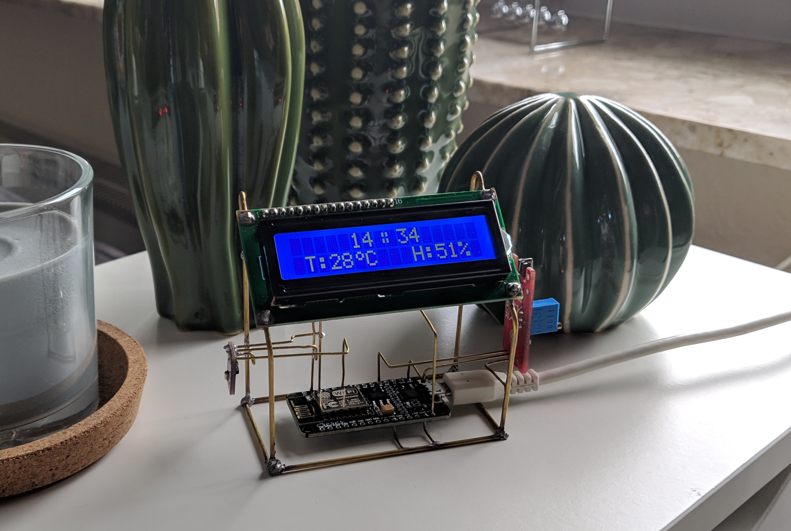
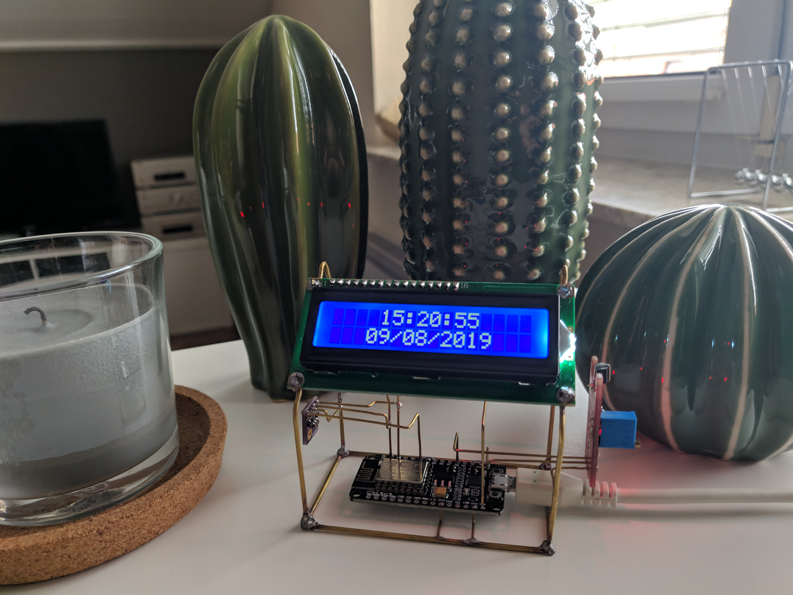
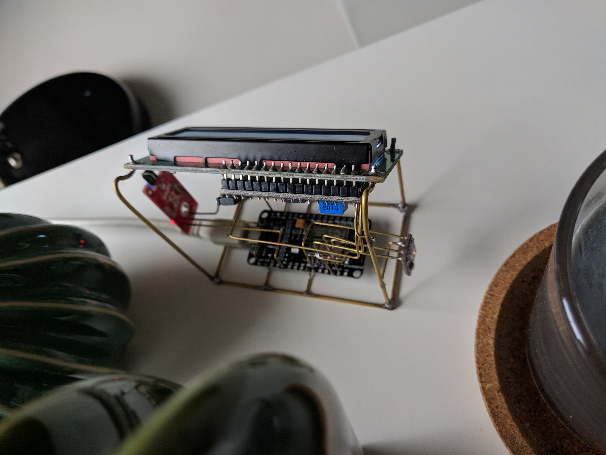
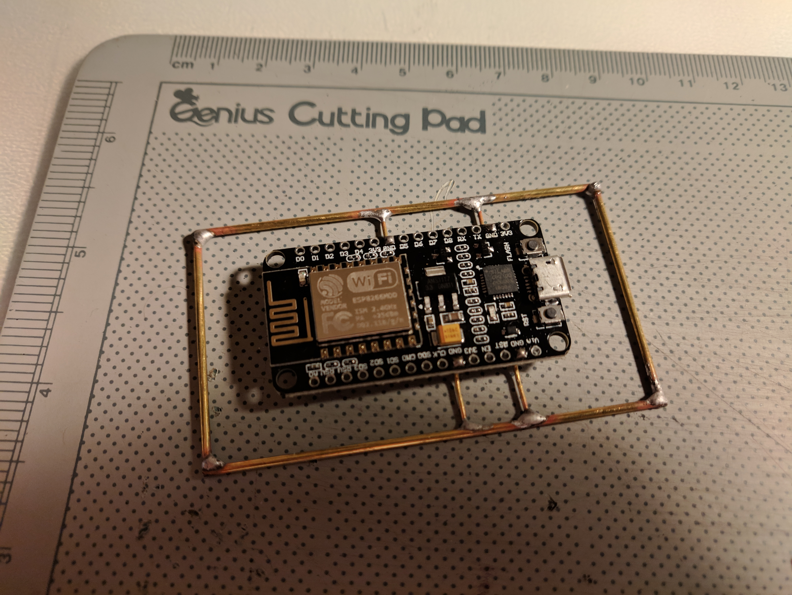

# NodeMCU-Dashboard
A dashboard/clock for the desk, powered by an NodeMCU microcontroler.
The clock is designed to handel multiple WiFi networks. It get's the current time from a NTP-server and is able to provide a local webpage with the current data from the BMP280 sensor. It shows information as time, date, temperature, humidity, pressure and it's IP adress on a 16x2 LCD-Display driven by an I2C adapter. The information is displayed at multiple pages, which can be scrolled through, by tapping a touch sensor. 

This page is shown by default:

This page shows the time and the date:

I 3d-printed a fixture to help me soldering the brass rods rectangular.

